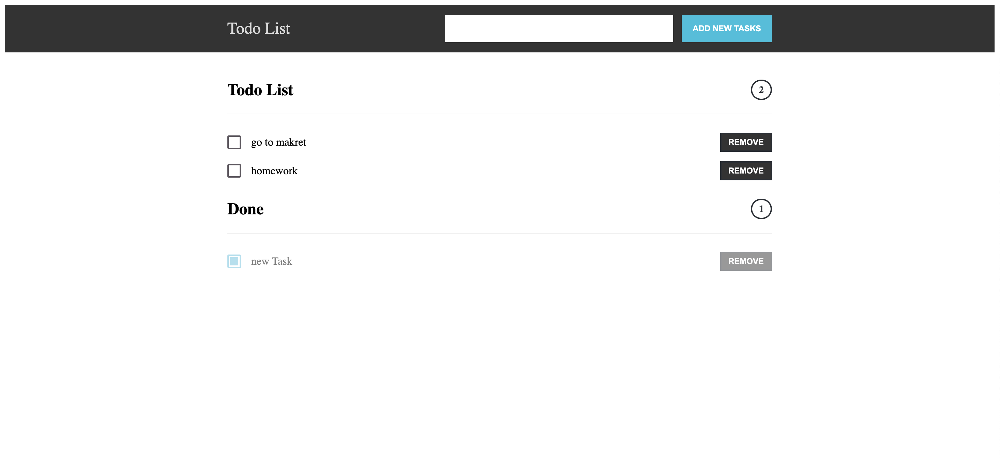

# Todo-Vue

Простой ToDo менеджер, реализованный на фреймворке Vue.



## Установка:

Устанавливаем и активируем виртуальное окружение

```
cd todo-vue
npm run build
```

Запускаем

```
npm run dev
```
